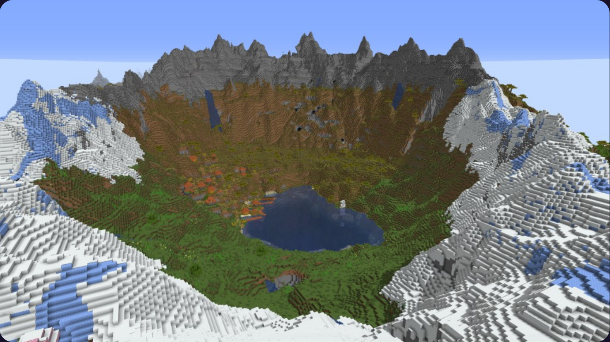

# void-mc

A leightweight Fabric Minecraft server connecting users via [Tailscale](https://tailscale.com/)

## Quick Start

### 1. Install Dependencies

```bash
make install-deps
```

This creates a Python virtual environment and installs required packages.

### 2. Run Setup Wizard

```bash
make setup
```

This launches an interactive configuration wizard that will:
- Prompt for Minecraft and Fabric versions
- Ask for server settings (seed, difficulty, gamemode, etc.)
- Request server IP and port (saved to `.env`)
- Migrate existing mod configurations from YAML to TOML
- Generate `config.toml` configuration file

### 3. Generate Configuration Files

```bash
make generate-config
```

This reads `config.toml` and generates JSON files for:
- `client-mods.json` - Client-side mod configuration
- `server-mods.json` - Server-side mod configuration
- `server-settings.json` - Server properties configuration

### 4. Run the Server (First Time)

```bash
# First run - this will generate server files and prompt for EULA acceptance
make run-server

# Accept the Minecraft EULA (required)
make accept-eula

# Run the server again - settings will be automatically injected
make run-server
```

> [!NOTE]
> If `eula.txt` doesn't appear after the first time running `run-server`
> then run `make run-server` an additional time before trying `make accept-eula`.
> For some odd reason the first time running `run-server` generates some but not all
> server files, I have no clue why this is the case, bu after the second `run-server`
> `server.properties` & `eula.txt` should appear in `server/` directory. 

**What happens on first run:**
1. Server mods are downloaded automatically
2. Server runs briefly to generate `eula.txt` and `server.properties`
3. You're prompted to accept the Minecraft EULA
4. After accepting with `make accept-eula`, the next `make run-server` will:
   - Verify EULA acceptance
   - Automatically inject settings from `server-settings.json` into `server.properties`
   - Start the server with your configured settings

**Optional:** Download client mods separately:
```bash
make client-mods
```

## Configuration

After running `make setup`, you can manually edit `config.toml` to:
- Add or remove mods
- Adjust server settings
- Customize server properties

After making changes to `config.toml`:
1. Run `make generate-config` to regenerate the JSON files
2. Run `make inject-settings` to update `server.properties` (or just restart the server - settings are auto-injected on each run)

## Available Make Targets

- `make install-deps` - Install Python dependencies
- `make setup` - Run interactive configuration wizard
- `make generate-config` - Generate JSON files from config.toml
- `make server-mods` - Download server mods
- `make client-mods` - Download client mods
- `make accept-eula` - Accept Minecraft EULA (required before first server run)
- `make inject-settings` - Manually inject server-settings.json into server.properties
- `make run-server` - Start the Minecraft server (auto-injects settings)
- `make clean` - Remove downloaded mods
- `make clean-all` - Remove all generated files and venv

## Utilities Versions

- [Minecraft](https://www.minecraft.net/): 1.21.11
- [Fabric Loader](https://fabricmc.net/): 0.18.3
- [Fabric Installer](https://fabricmc.net/use/installer/): 1.1.0

## Mod List

> [!NOTE]
> This list is subject to change before official version of the server is released

- [Sodium](https://modrinth.com/mod/sodium)
- [Lithium](https://modrinth.com/mod/lithium)
- [Chunky](https://modrinth.com/plugin/chunky)
- [Litematica](https://modrinth.com/mod/litematica)

## Seed

**6944174826991112**


